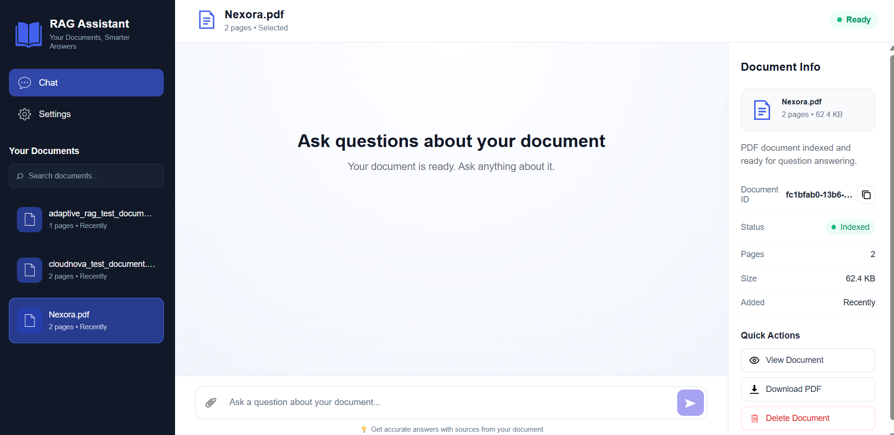
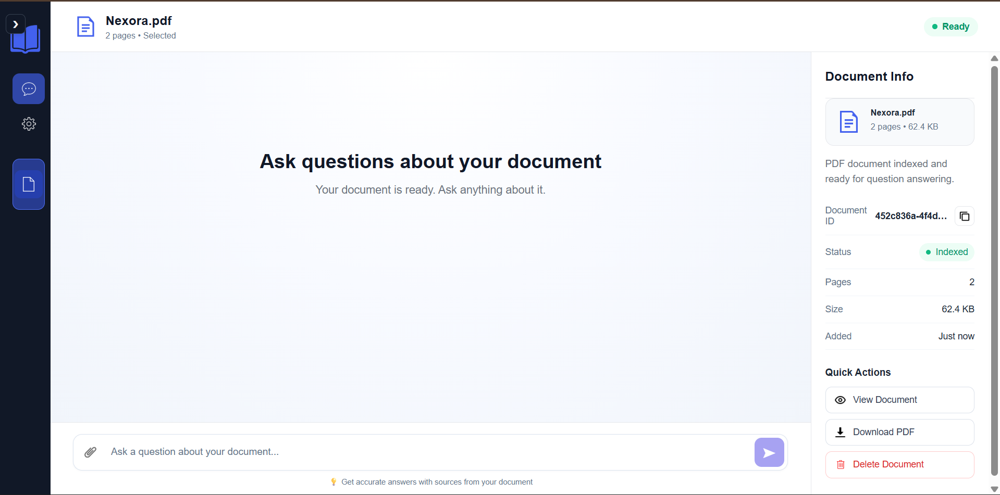
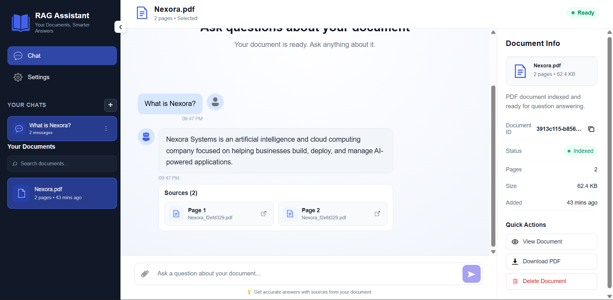

# 🤖 RAG Assistant

An AI-powered document question-answering system built using **Retrieval-Augmented Generation (RAG)**.

RAG Assistant allows users to upload PDF documents, ask questions about their content, maintain contextual conversations, and receive answers with source and page references.

The system combines **semantic vector retrieval, query rewriting, document-level filtering, Cross-Encoder reranking, conversational memory, and Google Gemini** to provide a practical production-style RAG experience.

## 🌐 Live Demo

### Frontend
https://production-rag-frontend-4g46.onrender.com/

### Backend API
https://production-rag-system-ho43.onrender.com

### API Documentation
https://production-rag-system-ho43.onrender.com/docs

### GitHub Repository
https://github.com/sheeban-sheikh/production-rag-system

## 🚀 Features

### 📄 Document Management

- 📄 PDF document upload
- 🛡️ 100 MB file-size validation
- 🔄 Duplicate filename handling
- 📚 Multi-document support
- 🆔 Unique document identification
- 🕒 Document creation timestamps
- 👁️ PDF document viewing
- ⬇️ PDF downloading
- 🗑️ Document deletion
- 🧹 Automatic deletion of chats associated with deleted documents

### 🧠 RAG Capabilities

- 🧠 Retrieval-Augmented Generation (RAG)
- 🔎 Semantic vector search
- 🎯 Top-K document retrieval
- 🏷️ Metadata-based document filtering
- 🔄 Conversational RAG
- ✍️ Query rewriting
- 💬 Conversation history
- 📝 Conversation summarization
- 🎯 Cross-Encoder reranking
- 📌 Source and page references
- ❌ Unanswerable-question handling
- 🔒 Document-level retrieval isolation

### 💬 Chat Management

- ➕ Create multiple chats
- 🏷️ Automatic chat titles
- ✏️ Rename chats
- 🔄 Revisit previous conversations
- 🗑️ Delete chats
- 📚 Document-specific chat association

### 🖥️ User Interface

- ⚛️ React + Vite frontend
- 📱 Responsive interface
- 📝 Markdown-formatted AI responses
- ⏳ Separate loading and upload states
- 📊 Document information panel
- 🗂️ Chat sidebar
- 🔗 Source navigation
- 🎨 Custom favicon and application title

### ⚡ Backend & API

- 🚀 FastAPI REST API
- 🔌 Modular API route architecture
- 🛡️ Input validation and error handling
- 🌐 CORS configuration
- ❤️ Health-check endpoint
- 📝 Application logging
- 🔀 Separate document indexing and query processing

### 🧪 Evaluation & Testing

- 📊 Retrieval evaluation
- ✅ Answer correctness evaluation
- 🎯 Faithfulness evaluation
- ❌ Unanswerable-question evaluation
- 💬 Conversational follow-up testing
- 📚 Multi-document isolation testing
- 🧪 Failure-path and error handling tests

## 📸 Screenshots

### Document Workspace

The main workspace allows users to select a document and start asking questions.



### Document Information

The Document Info panel displays document metadata such as page count, file size, document ID, indexing status, and creation time.



### Conversational RAG

Users can ask questions about the selected document and receive contextual answers with relevant source and page references.



## 🎥 Demo

Watch the complete RAG Assistant demo:

[▶️ Watch Demo Video](demo/rag-assistant-demo.mp4)

## 🏗️ Architecture

The application follows a **React + FastAPI + RAG** architecture with a modular backend design.

### Frontend

The frontend is responsible for the user interface and client-side interaction.

- React
- Vite
- JavaScript
- CSS
- React Markdown

The frontend provides:

- Chat interface
- Document selection
- Document workspace
- Document information panel
- PDF upload
- Chat management
- Source navigation
- Loading and upload states
- Responsive user interface

### Backend

The backend provides the API layer and handles the complete RAG workflow.

- Python
- FastAPI
- Uvicorn
- LangChain

The backend is responsible for:

- PDF ingestion
- Text extraction
- Document chunking
- Embedding generation
- Vector storage
- Semantic retrieval
- Metadata filtering
- Query rewriting
- Cross-Encoder reranking
- Answer generation
- Conversation history
- Conversation summarization
- Document management
- Chat management

### AI & Retrieval Layer

The AI/RAG layer consists of:

- Google Gemini LLM
- Gemini Embeddings
- ChromaDB
- Cross-Encoder reranker

The retrieval process uses a two-stage approach:

```text
User Query
    ↓
Query Rewriting
    ↓
Metadata Filtering
    ↓
Vector Similarity Search
    ↓
Top-K Candidates
    ↓
Cross-Encoder Reranking
    ↓
Top-N Relevant Chunks
    ↓
Gemini LLM
    ↓
Answer + Sources
```

### High-Level System Architecture

```text
                    ┌─────────────────────┐
                    │   React + Vite      │
                    │      Frontend       │
                    └──────────┬──────────┘
                               │
                               │ REST API
                               ▼
                    ┌─────────────────────┐
                    │       FastAPI       │
                    │       Backend       │
                    └──────────┬──────────┘
                               │
              ┌────────────────┼────────────────┐
              │                │                │
              ▼                ▼                ▼
       Document Routes    Chat Routes     Chat Management
              │                │
              ▼                ▼
        PDF Ingestion      RAG Service
                               │
                               ▼
                       Query Rewriting
                               │
                               ▼
                       Vector Retrieval
                               │
                               ▼
                       Cross-Encoder
                        Reranking
                               │
                               ▼
                         Gemini LLM
                               │
                               ▼
                       Answer + Sources
```

### Document Indexing Flow

```text
PDF Upload
    ↓
PDF Loader
    ↓
Text Extraction
    ↓
Chunking
    ↓
Gemini Embeddings
    ↓
ChromaDB
```

### Query Processing Flow

```text
User Query
    ↓
Conversation History
    ↓
Query Rewriting
    ↓
Document Metadata Filtering
    ↓
Vector Similarity Search
    ↓
Cross-Encoder Reranking
    ↓
Relevant Context
    ↓
Gemini LLM
    ↓
Answer + Source References
```

## 🛠️ Tech Stack

### Frontend

| Technology | Purpose |
|---|---|
| React | User interface |
| Vite | Frontend build tool |
| JavaScript | Application logic |
| CSS | Styling |
| React Markdown | Rendering AI responses |

### Backend

| Technology | Purpose |
|---|---|
| Python | Backend development |
| FastAPI | REST API framework |
| Uvicorn | ASGI server |
| LangChain | RAG orchestration |

### AI / RAG

| Technology | Purpose |
|---|---|
| Google Gemini | Large Language Model |
| Gemini Embeddings | Document and query embeddings |
| ChromaDB | Vector database |
| Sentence Transformers | Cross-Encoder reranking |
| Cross-Encoder | Retrieved document reranking |

### Document Processing

| Technology | Purpose |
|---|---|
| PyPDF | PDF loading and text extraction |
| LangChain Text Splitters | Document chunking |

### Development & Deployment

| Technology | Purpose |
|---|---|
| Git | Version control |
| GitHub | Source code hosting |
| Render | Cloud deployment |
| `.env` | Environment variable management |

## 📁 Project Structure

```text
production-rag-system/
│
├── backend/
│   ├── index.py
│   ├── main.py
│   │
│   ├── api/
│   │   ├── app.py
│   │   └── routes/
│   │       ├── chat.py
│   │       ├── chats.py
│   │       ├── documents.py
│   │       └── __init__.py
│   │
│   └── src/
│       ├── chat_history.py
│       ├── chunker.py
│       ├── config.py
│       ├── embeddings.py
│       ├── evaluator.py
│       ├── ingestion.py
│       ├── llm.py
│       ├── loader.py
│       ├── logger.py
│       ├── prompt.py
│       ├── query_rewriter.py
│       ├── rag.py
│       ├── rag_service.py
│       ├── reranker.py
│       └── vector_store.py
│
├── frontend/
│   ├── public/
│   │   └── favicon.png
│   │
│   └── src/
│       ├── components/
│       │   ├── ChatInput.jsx
│       │   ├── ChatWindow.jsx
│       │   ├── DocumentInfo.jsx
│       │   ├── DocumentList.jsx
│       │   ├── Settings.jsx
│       │   └── Sidebar.jsx
│       │
│       ├── services/
│       │   └── api.js
│       │
│       ├── App.jsx
│       ├── App.css
│       └── main.jsx
│
├── evaluation/
│
├── screenshots/
│
├── data/                    # Local uploaded PDFs
├── chroma_db/               # Local ChromaDB data
│
├── .env                     # Local environment variables
├── .gitignore
├── package.json
├── pyproject.toml
├── requirements.txt
├── requirements-local.txt
├── uv.lock
└── README.md
```

> **Note:** `data/`, `chroma_db/`, and `.env` are local/runtime resources and should not be committed to GitHub.

## 📋 Prerequisites

Make sure the following are installed before running the project locally:

- Python 3.14+
- Node.js
- npm
- Git

You will also need:

- A Google Gemini API key
- Basic knowledge of Python and JavaScript
- A modern web browser

## ⚙️ Installation

### 1. Clone the Repository

```bash
git clone https://github.com/sheeban-sheikh/production-rag-system.git
cd production-rag-system
```

### 2. Create Python Environment

```bash
python -m venv .venv
```

#### Windows

```bash
.venv\Scripts\activate
```

#### macOS / Linux

```bash
source .venv/bin/activate
```

### 3. Install Backend Dependencies

For the production dependency set:

```bash
pip install -r requirements.txt
```

For local development with Cross-Encoder support:

```bash
pip install -r requirements-local.txt
```

### 4. Configure Environment Variables

Create a `.env` file in the project root:

```env
GOOGLE_API_KEY=your_google_gemini_api_key
```

For local development with Cross-Encoder reranking:

```env
USE_CROSS_ENCODER=true
```

For lower-memory environments:

```env
USE_CROSS_ENCODER=false
```

> **Never commit your `.env` file or API keys to GitHub.**

---

## 🚀 Running the Application

The application consists of two services:

- FastAPI backend
- React frontend

### Backend

From the project root:

```bash
cd backend
uvicorn api.app:app --reload
```

The backend will be available at:

```text
http://127.0.0.1:8000
```

### API Documentation

FastAPI provides interactive API documentation at:

```text
http://127.0.0.1:8000/docs
```

### Health Check

```text
http://127.0.0.1:8000/health
```

Expected response:

```json
{
  "status": "ok"
}
```

### Frontend

Open a new terminal:

```bash
cd frontend
npm install
npm run dev
```

The frontend will be available at:

```text
http://localhost:5173
```

---

## 🔌 API Endpoints

| Method | Endpoint | Description |
|---|---|---|
| GET | `/health` | Check API health |
| GET | `/documents` | Get all indexed documents |
| POST | `/documents/upload` | Upload and index a PDF |
| DELETE | `/documents/{document_id}` | Delete a document |
| GET | `/documents/{document_id}/view` | View a PDF document |
| GET | `/documents/{document_id}/download` | Download a PDF |
| POST | `/chat` | Ask a question about a document |
| POST | `/chats` | Create a new chat |
| GET | `/chats` | Get all chats |
| GET | `/chats/{chat_id}` | Get a specific chat |
| PATCH | `/chats/{chat_id}` | Rename a chat |
| DELETE | `/chats/{chat_id}` | Delete a chat |

### Example Chat Request

```json
{
  "query": "What is this document about?",
  "chat_id": "your-chat-id"
}
```

### Example Chat Response

```json
{
  "answer": "The document discusses ...",
  "sources": [
    {
      "document": "example.pdf",
      "page": 2,
      "document_id": "your-document-id"
    }
  ]
}
```

---

## 🧠 How the RAG System Works

### 1. Document Ingestion

When a PDF is uploaded, the system processes it through the following pipeline:

```text
PDF Upload
    ↓
PDF Loader
    ↓
Text Extraction
    ↓
Document Chunking
    ↓
Gemini Embeddings
    ↓
ChromaDB
```

Each document receives a unique `document_id`.

This ID is stored in the document chunk metadata and is used to maintain document-level retrieval isolation.

### 2. Document Chunking

Documents are divided into smaller chunks before generating embeddings.

Current configuration:

```text
Chunk Size    : 1000
Chunk Overlap : 200
```

Chunking allows the retrieval system to work with relevant portions of a document instead of passing the entire document to the LLM.

### 3. Embedding Generation

The system uses Google's Gemini embedding model:

```text
models/gemini-embedding-001
```

Document chunks are converted into vector representations and stored in ChromaDB.

### 4. Vector Retrieval

When a user asks a question, the system performs semantic similarity search.

Current configuration:

```text
Retrieval K = 5
```

The system initially retrieves the top 5 candidate chunks.

### 5. Metadata Filtering

When a document is selected, retrieval is restricted using its `document_id`.

```text
User Query
    ↓
Selected Document ID
    ↓
Metadata Filter
    ↓
Vector Search
```

This prevents chunks from unrelated documents from being used as context.

### 6. Query Rewriting

For conversational questions, the system uses conversation history to rewrite follow-up questions into standalone queries.

Example:

```text
User:
What is the company's revenue?

Assistant:
The company's revenue was ...

User:
How did it change in 2025?
```

The second question can be rewritten using the previous conversation context before retrieval.

```text
Conversation History
        +
Current User Query
        ↓
Query Rewriting
        ↓
Standalone Query
        ↓
Vector Retrieval
```

### 7. Cross-Encoder Reranking

After vector retrieval, the retrieved chunks are passed through a Cross-Encoder reranker.

Current configuration:

```text
Initial Candidates : 5
Final Context      : 3
```

Pipeline:

```text
Vector Search
     ↓
Top 5 Chunks
     ↓
Cross-Encoder
     ↓
Relevance Scoring
     ↓
Top 3 Chunks
```

The Cross-Encoder provides a second-stage relevance ranking before the context is passed to the LLM.

For lower-memory environments, reranking can be disabled:

```env
USE_CROSS_ENCODER=false
```

When disabled, the system uses the vector-search ranking directly.

### 8. Answer Generation

The final relevant chunks are passed to the Gemini LLM along with the user's query and relevant conversation context.

The model is instructed to answer using the provided document context.

If the required information cannot be found, the system can return:

```text
I don't know based on the provided document.
```

This provides explicit handling for unanswerable questions.

### 9. Source Attribution

The generated response can include:

- Document name
- Page number
- Document ID

Example:

```json
{
  "document": "example.pdf",
  "page": 2,
  "document_id": "your-document-id"
}
```

Users can use the source references to navigate to the relevant PDF page.

---

## 💬 Conversational RAG

The system maintains conversation history for each chat.

This allows users to ask follow-up questions without repeating the complete context.

The conversational flow is:

```text
User Query
    ↓
Conversation History
    ↓
Query Rewriting
    ↓
Standalone Query
    ↓
Document Retrieval
    ↓
Reranking
    ↓
Answer Generation
```

The system also includes conversation summarization to retain important information when conversations become longer than the configured history window.

---

## 📚 Multi-Document RAG

The application supports multiple PDF documents.

Each document receives a unique identifier:

```text
Document A → document_id_A
Document B → document_id_B
Document C → document_id_C
```

When a user selects a document, retrieval is filtered using that document's ID.

```text
User Query
    ↓
Selected Document
    ↓
Document ID Filter
    ↓
Relevant Chunks
    ↓
Reranking
    ↓
Answer
```

This ensures that the answer is generated using the selected document's context.

---

## 🗂️ Chat Management

The application supports multiple independent conversations.

Users can:

- Create new chats
- Ask questions
- Revisit previous chats
- Rename chats
- Delete chats

Chat titles are automatically generated from the first user question and can later be renamed.

Each chat is associated with a specific document.

When a document is deleted, its associated chats are also removed.

---

## 🗑️ Document Lifecycle

The document lifecycle follows:

```text
Upload
  ↓
Index
  ↓
Select
  ↓
Query
  ↓
View / Download
  ↓
Delete
```

When a document is deleted:

```text
Delete Document
      │
      ├── Delete document chunks from ChromaDB
      │
      └── Delete chats associated with the document
```

This keeps document and chat state synchronized.

---

## ⏱️ Document Metadata

Uploaded documents maintain metadata including:

- Document ID
- Document name
- Page count
- File size
- Status
- Creation timestamp

The frontend displays relative timestamps for uploaded documents.

Examples:

```text
Just now
5 minutes ago
2 hours ago
Yesterday
```

---

## 🧪 Evaluation

The RAG pipeline was evaluated using a small synthetic evaluation dataset covering relevant, conversational, and unanswerable questions.

### Evaluation Results

| Metric | Result |
|---|---:|
| Retrieval Precision | 81.25% |
| Retrieval Recall | 100% |
| Answer Correctness | 100% |
| Faithfulness | 100% |

### Unanswerable Question Handling

```text
2 / 2 passed
```

The system successfully handled questions where the required information was not available in the provided document.

> **Note:** These results were obtained on a small synthetic evaluation dataset and should not be interpreted as universal production performance metrics.

---

## 🧪 Testing

The application was tested across multiple functional and failure scenarios.

### Document Management

- PDF upload
- Invalid file validation
- 100 MB file-size validation
- Duplicate filename handling
- Multiple document support
- Document selection
- Document switching
- Document isolation
- Document deletion
- PDF viewing
- PDF downloading
- Document metadata
- Upload status handling

### Chat

- Normal questions
- Empty questions
- Spaces-only questions
- Long questions
- Enter-to-send
- Shift + Enter multiline input
- Conversational follow-up questions
- Query rewriting
- Markdown responses
- Source references
- Unanswerable questions
- Chat creation
- Chat revisit
- Chat rename
- Chat deletion
- Loading states
- API error handling

### RAG Pipeline

- Vector retrieval
- Metadata filtering
- Cross-Encoder reranking
- Query rewriting failure handling
- Reranker failure handling
- Answer generation failure handling
- Conversation summarization
- Multi-document isolation

---

## ☁️ Deployment

The application is deployed on **Render** using separate frontend and backend services.

### Frontend

```text
React + Vite
     ↓
Render Static Site
     ↓
Production Frontend
```

Live frontend:

https://production-rag-frontend-4g46.onrender.com/

### Backend

```text
FastAPI
   ↓
Uvicorn
   ↓
Render Web Service
```

Live backend:

https://production-rag-system-ho43.onrender.com

### API Documentation

https://production-rag-system-ho43.onrender.com/docs

### Frontend Environment Variable

```env
VITE_API_BASE_URL=https://production-rag-system-ho43.onrender.com
```

---

## ⚠️ Current Deployment Limitation

The current deployment uses free-tier infrastructure.

The application currently stores:

- ChromaDB data locally
- Uploaded PDF files locally
- Chat history in application memory

Therefore, these resources are **not guaranteed to survive a Render service restart or redeployment**.

The current live deployment should therefore be considered a **portfolio/demo deployment rather than a fully persistent production system**.

The application architecture can be extended with persistent external storage in the future.

---

## 🔮 Future Improvements

Planned production-level improvements include:

- Persistent vector database using Qdrant
- Persistent chat storage using PostgreSQL or Supabase
- Cloud object storage for uploaded PDFs
- User authentication and authorization
- Multi-user support
- Streaming LLM responses
- Hybrid semantic + keyword search
- Larger and more diverse evaluation datasets
- Advanced observability and monitoring
- Production-grade logging
- Docker-based deployment
- Secure production secret management
- Improved scalability

### Possible Future Architecture

```text
                    ┌──────────────────┐
                    │  React Frontend  │
                    └────────┬─────────┘
                             │
                             ▼
                    ┌──────────────────┐
                    │ FastAPI Backend  │
                    └────────┬─────────┘
                             │
              ┌──────────────┼──────────────┐
              │              │              │
              ▼              ▼              ▼
        Qdrant Cloud     PostgreSQL    Object Storage
          Vectors       Chat History        PDFs
              │              │              │
              └──────────────┼──────────────┘
                             ▼
                        Gemini LLM
```

---

## 🌟 Project Highlights

This project demonstrates practical implementation of:

- Retrieval-Augmented Generation
- Conversational RAG
- Query rewriting
- Vector similarity search
- Metadata filtering
- Multi-document retrieval
- Document-level isolation
- Cross-Encoder reranking
- Source attribution
- Conversation history
- Conversation summarization
- Unanswerable-question handling
- FastAPI backend development
- React frontend development
- REST API design
- Document lifecycle management
- Chat lifecycle management
- RAG evaluation
- Failure-path testing
- Cloud deployment

---

## 📌 Project Status

**Version:** `1.0.0`

**Status:** Portfolio-ready / Production-style RAG application

The project currently includes:

- Complete React frontend
- FastAPI backend
- Conversational RAG pipeline
- Query rewriting
- Multi-document support
- Metadata filtering
- Cross-Encoder reranking
- Document management
- Chat management
- Source attribution
- Evaluation framework
- Functional testing
- Live cloud deployment

The primary remaining production-level limitation is **persistent storage across infrastructure restarts and redeployments**.

---

## 👨‍💻 Author

**Sheeban Sheikh**

B.Tech — Artificial Intelligence & Data Science

### GitHub

https://github.com/sheeban-sheikh

### LinkedIn

https://www.linkedin.com/in/sheeban-sheikh/

---

## 📄 License

This project is intended for educational, learning, and portfolio purposes.
