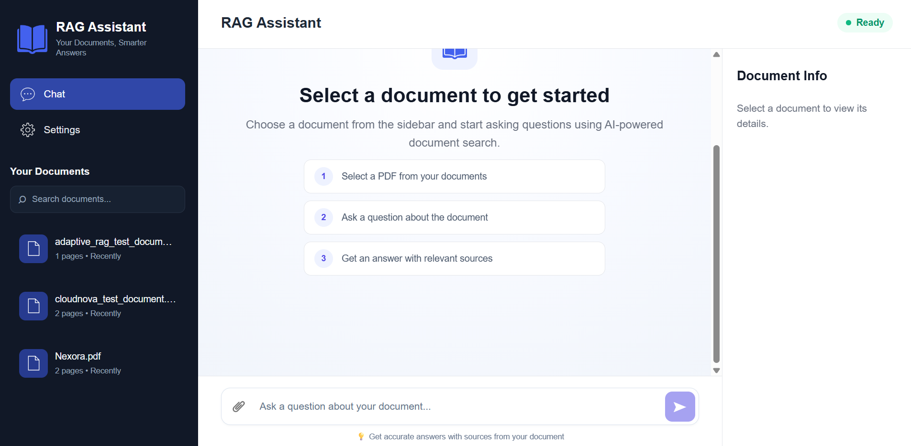

# RAG Assistant

An AI-powered document question-answering system that allows users to upload PDF documents and ask questions about their content.

The system uses Retrieval-Augmented Generation (RAG) to retrieve relevant document content before generating answers, helping reduce hallucinations and providing source references for answers.

## 🚀 Features

- 📄 PDF document upload
- 🔎 Semantic document search
- 🧠 Retrieval-Augmented Generation (RAG)
- 🔄 Conversational RAG with query rewriting
- 📚 Multi-document support
- 🎯 Cross-encoder reranking
- 📌 Source and page references
- 💬 Context-aware conversations
- 🗂️ Document management
- 👁️ PDF document viewing
- ⬇️ PDF downloading
- 🗑️ Document deletion
- ⚙️ Settings dashboard
- ⚡ React + FastAPI architecture
- 🛡️ 100 MB upload validation
- ❌ Unanswerable-question handling
- 🧪 Retrieval and answer evaluation

## Screenshots

### Document Selection



### Document Workspace


## 🏗️ Architecture

The application is divided into two main layers:

### Frontend

- React
- Vite
- React Markdown

The frontend provides the chat interface, document management, document information panel, settings, upload functionality, and source navigation.

### Backend

- Python
- FastAPI
- LangChain
- Gemini
- ChromaDB
- Hugging Face Sentence Transformers
- Cross-Encoder

The backend handles document ingestion, chunking, embeddings, retrieval, reranking, query rewriting, conversation history, and answer generation.

### RAG Pipeline

```text
PDF Upload
    ↓
PDF Loading
    ↓
Document Chunking
    ↓
Embedding Generation
    ↓
ChromaDB
    ↓
User Query
    ↓
Query Rewriting
    ↓
Vector Retrieval
    ↓
Cross-Encoder Reranking
    ↓
Relevant Context
    ↓
Gemini LLM
    ↓
Answer + Sources

## 🛠️ Tech Stack

### Frontend

- React
- Vite
- JavaScript
- CSS
- React Markdown

### Backend

- Python
- FastAPI
- Uvicorn

### AI / RAG

- LangChain
- Google Gemini
- Hugging Face Sentence Transformers
- Cross-Encoder Reranker

### Vector Database

- ChromaDB

### Document Processing

- PyPDF
- Text Splitters

### Development

- Git
- GitHub
- Environment Variables (`.env`)

## 📁 Project Structure

```text
basic-rag/
│
├── api/
│   ├── app.py
│   └── routes/
│       ├── chat.py
│       └── documents.py
│
├── src/
│   ├── chat_history.py
│   ├── chunker.py
│   ├── config.py
│   ├── ingestion.py
│   ├── loader.py
│   ├── logger.py
│   ├── query_rewriter.py
│   ├── rag.py
│   ├── rag_service.py
│   ├── reranker.py
│   └── vector_store.py
│
├── frontend/
│   └── src/
│       ├── components/
│       ├── pages/
│       ├── services/
│       ├── App.jsx
│       └── main.jsx
│
├── data/              # Local uploaded PDFs
├── chroma_db/         # Local vector database
├── .env               # Local environment variables
├── .gitignore
├── pyproject.toml
├── requirements.txt
└── README.md
```

> **Note:** `data/`, `chroma_db/`, and `.env` are local/runtime resources and should not be committed to GitHub.

## 📋 Prerequisites

Make sure the following are installed:

- Python 3.12+
- Node.js 18+
- npm
- Git

You will also need a Google Gemini API key for answer generation.

## ⚙️ Installation

### 1. Clone the Repository

```bash
git clone https://github.com/sheeban-sheikh/basic-rag.git
cd basic-rag
```

### 2. Create Python Environment

```bash
python -m venv .venv
```

Activate the environment.

#### Windows

```bash
.venv\Scripts\activate
```

#### macOS / Linux

```bash
source .venv/bin/activate
```

### 3. Install Backend Dependencies

```bash
pip install -r requirements.txt
```

### 4. Configure Environment Variables

Create a `.env` file in the project root:

```env
GOOGLE_API_KEY=your_google_gemini_api_key
```

Replace `your_google_gemini_api_key` with your actual API key.

**Never commit the `.env` file to GitHub.**

### 5. Start the Backend

From the project root:

```bash
uvicorn api.app:app --reload
```

The API will be available at:

```text
http://127.0.0.1:8000
```

Interactive API documentation:

```text
http://127.0.0.1:8000/docs
```
## 💻 Frontend Setup

Open a new terminal and navigate to the frontend directory:

```bash
cd frontend
```

Install frontend dependencies:

```bash
npm install
```

Start the development server:

```bash
npm run dev
```

The frontend will be available at:

```text
http://localhost:5173
```

### Running the Application

Run both services simultaneously:

**Backend:**

```bash
uvicorn api.app:app --reload
```

**Frontend:**

```bash
cd frontend
npm run dev
```

Then open the frontend URL in your browser:

```text
http://localhost:5173
```

## 🔌 API Endpoints

| Method | Endpoint | Description |
|---|---|---|
| GET | `/health` | Check API health |
| GET | `/documents` | Get all indexed documents |
| POST | `/documents/upload` | Upload and index a PDF |
| DELETE | `/documents/{document_id}` | Delete a document |
| GET | `/documents/{document_id}/view` | View a PDF document |
| GET | `/documents/{document_id}/download` | Download a PDF |
| POST | `/chat` | Ask a question about a document |

### Example Chat Request

```json
{
  "query": "What is this document about?",
  "document_id": "your-document-id"
}
```

### Example Chat Response

```json
{
  "answer": "The document discusses ...",
  "sources": [
    {
      "document": "example.pdf",
      "page": 2,
      "document_id": "your-document-id"
    }
  ]
}
```

## 🧠 How the RAG System Works

### 1. Document Ingestion

When a PDF is uploaded:

```text
PDF
 ↓
PDF Loader
 ↓
Text Extraction
 ↓
Chunking
 ↓
Embeddings
 ↓
ChromaDB
```

Each document is assigned a unique `document_id`, which allows the system to maintain document-level isolation.

### 2. Query Processing

When a user asks a question:

```text
User Query
 ↓
Conversation History
 ↓
Query Rewriting
 ↓
Vector Search
 ↓
Top-K Retrieved Chunks
 ↓
Cross-Encoder Reranking
 ↓
Top-N Relevant Chunks
 ↓
Gemini LLM
 ↓
Answer + Sources
```

### 3. Query Rewriting

For conversational questions, the system uses the conversation history to rewrite follow-up questions into standalone queries.

For example:

```text
User:
"What is the revenue?"

User:
"How did it change in 2025?"
```

The second question can be rewritten using the previous conversation context before retrieval.

### 4. Retrieval and Reranking

The system initially retrieves the top `5` relevant chunks using vector similarity search.

A Cross-Encoder reranker then evaluates the retrieved chunks and selects the top `3` most relevant chunks before sending them to the LLM.

This two-stage retrieval approach helps improve the relevance of the context provided to the model.

### 5. Source Attribution

The generated answer includes source references containing:

- Document name
- Page number
- Document ID

Users can open the referenced PDF page directly from the source section.

## 🧪 Evaluation

The RAG pipeline was evaluated using a small synthetic evaluation dataset covering relevant, conversational, and unanswerable questions.

### Evaluation Results

| Metric | Result |
|---|---:|
| Retrieval Precision | 81.25% |
| Retrieval Recall | 100% |
| Answer Correctness | 100% |
| Faithfulness | 100% |

### Unanswerable Question Handling

Unanswerable-question tests:

```text
2 / 2 passed
```

The system returns an explicit fallback response when relevant information cannot be found in the provided document.

> **Note:** These results were obtained on a small synthetic evaluation dataset and should not be interpreted as universal production performance metrics.

## ✅ Testing

The application was tested across the following scenarios:

### Document Management

- PDF upload
- Invalid file validation
- 100 MB file-size validation
- Duplicate filename handling
- Multiple document support
- Document search
- Document switching
- Document deletion
- PDF viewing
- PDF downloading

### Chat

- Normal questions
- Empty questions
- Spaces-only questions
- Long questions
- Enter-to-send
- Shift + Enter multiline input
- Conversational follow-up questions
- Markdown responses
- Source references
- Unanswerable questions
- Loading states
- API error handling

### Document Isolation

Each document maintains its own retrieval context and conversation history.

Switching between documents starts a fresh frontend chat while preserving document-level backend context.

All currently tested scenarios passed successfully.

## 🔮 Future Improvements

The current system is designed as a single-user local application. Possible future improvements include:

- 🔐 User authentication and authorization
- 👥 Multi-user support
- 🗄️ Persistent conversation storage
- ☁️ Cloud deployment
- 📊 Advanced retrieval evaluation with larger datasets
- ⚡ Streaming LLM responses
- 🧠 Hybrid search combining semantic and keyword retrieval
- 🔍 Advanced metadata-based filtering
- 📈 Observability and production monitoring
- 🐳 Docker-based deployment
- 🔑 Secure production secret management

## 🌟 Project Highlights

This project demonstrates practical implementation of:

- Retrieval-Augmented Generation (RAG)
- Conversational RAG
- Query rewriting
- Vector similarity search
- Cross-encoder reranking
- Multi-document retrieval
- Document-level isolation
- Source attribution
- Conversation history and summarization
- FastAPI backend development
- React frontend development
- RAG evaluation and testing

## 📌 Project Status

**Version:** 1.0.0

The current version is a functional portfolio project with a complete React frontend and FastAPI backend.

## 📄 License

This project is intended for educational and portfolio purposes.
